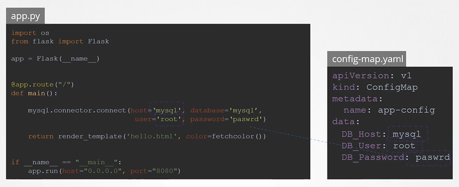
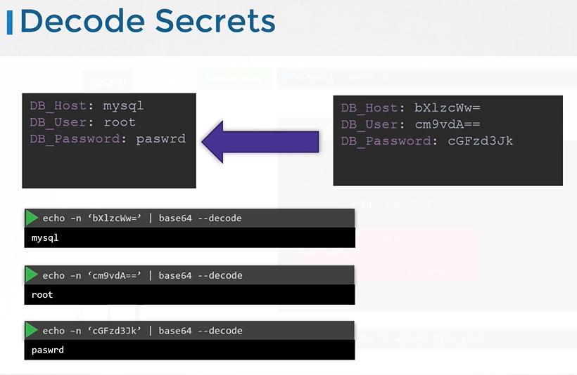

# Manage Kubernetes Secrets
  - Take me to [Video Tutorial](https://kodekloud.com/courses/1378608/lectures/31704676)

In this section, we will take a look at Manage Kubernetes Secrets


## Web-Mysql Application

 

- One way is to move the app properties/envs into a configmap. But the configmap stores data into a plain text format. It is definitely not a right place to store a password.
  ```
  apiVersion: v1
  kind: ConfigMap
  metadata:
   name: app-config
  data:
    DB_Host: mysql
    DB_User: root
    DB_Password: paswrd
  ```
  

- Secrets are used to store sensitive information. They are similar to configmaps but they are stored in an encrypted format or a hashed format.

#### There are 2 steps involved with secrets
- First, Create a secret
- Second, Inject the secret into a pod.

  

#### There are 2 ways of creating a secret
- The Imperative way
  ```
  $ kubectl create secret generic app-secret --from-literal=DB_Host=mysql --from-literal=DB_User=root --from-literal=DB_Password=paswrd
  $ kubectl create secret generic app-secret --from-file=app_secret.properties
  ```
  

- The Declarative way
  ```
  Generate a hash value of the password and pass it to secret-data.yaml definition value as a value to DB_Password varaible.
  $ echo -n "mysql" |base64
  $ echo -n "root" |base64
  $ echo -n "paswrd"|base64
  ```

  Create a secret definition file and run `kubectl create` to deploy it
  ```
  apiVersion: v1
  kind: Secret
  metadata:
   name: app-secret
  data:
    DB_Host: bX1zcWw=
    DB_User: cm9vdA==
    DB_Password: cGFzd3Jk
  ```
  ```
  $ kubectl create -f secret-data.yaml
  ```

  

## Encode Secrets

  

## View Secrets
- To view secrets
  ```
  $ kubectl get secrets
  ```
- To describe secret
  ```
  $ kubectl describe secret
  ```
- To view the values of the secret
  ```
  $ kubectl get secret app-secret -o yaml
  ```

  

## Decode Secrets
- To decode secrets
  ```
  $ echo -n "bX1zcWw=" |base64 --decode
  $ echo -n "cm9vdA==" |base64 --decode
  $ echo -n "cGFzd3Jk" |base64 --decode
  ```
  

## Configuring secret with a pod
- To inject a secret to a pod add a new property **`envFrom`** followed by **`secretRef`** name and then create the pod-definition

  ```
  apiVersion: v1
  kind: Secret
  metadata:
   name: app-secret
  data:
    DB_Host: bX1zcWw=
    DB_User: cm9vdA==
    DB_Password: cGFzd3Jk
  ```
  ```
   apiVersion: v1
   kind: Pod
   metadata:
     name: simple-webapp-color
   spec:
    containers:
    - name: simple-webapp-color
      image: simple-webapp-color
      ports:
      - containerPort: 8080
      envFrom:
      - secretRef:
          name: app-secret
   ```
  ```
  $ kubectl create -f pod-definition.yaml
  ```
  

#### There are other ways to inject secrets into pods.
- You can inject as **`Single ENV variable`**
- You can inject as whole secret as files in a **`Volume`**

  

## Secrets in pods as volume
- Each attribute in the secret is created as a file with the value of the secret as its content.

  


#### Additional Notes: [A Note on Secrets](https://kodekloud.com/courses/certified-kubernetes-administrator-with-practice-tests/lectures/10589148)

#### K8s Reference Docs
- https://kubernetes.io/docs/concepts/configuration/secret/
- https://kubernetes.io/docs/concepts/configuration/secret/#use-cases
- https://kubernetes.io/docs/tasks/inject-data-application/distribute-credentials-secure/
