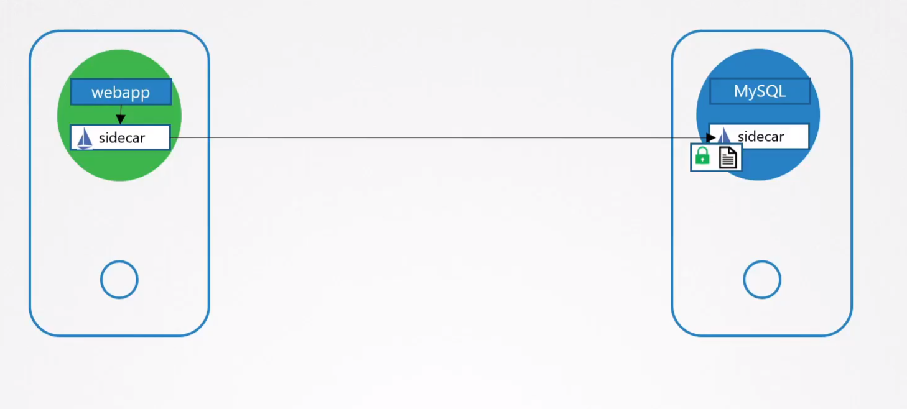
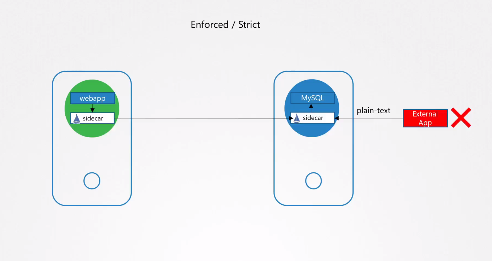

# Implement pod to pod encryption by use of mTLS
  - Take me to [Video Tutorial](https://kodekloud.com/courses/1378608/lectures/31704732)

In this section, we will take a look at Implement pod to pod encryption by use of mTLS

- it is a better to let the communications between pods without encryption format and use other ways to add the encrypted format on top.

- lstio and linkerd enable mutual Transport Layer Security (mTLS) for most TCP traffic between meshed pods.

  

- You add Istio support to services by deploying a special sidecar proxy throughout your environment that intercepts all network communication between micro services.

  

- Lstio External inbound traffic This is traffic coming from an outside client that is captured by the sidecar. If the client is inside the mesh, this traffic may be encrypted with Istio mutual TLS. By default, the sidecar will be configured to accept both mTLS and non-mTLS traffic, known as **`PERMISSIVE mode`**. The mode can alternatively be configured to **`STRICT`**, where traffic must be mTLS, or DISABLE, where traffic must be plaintext.

  

  
